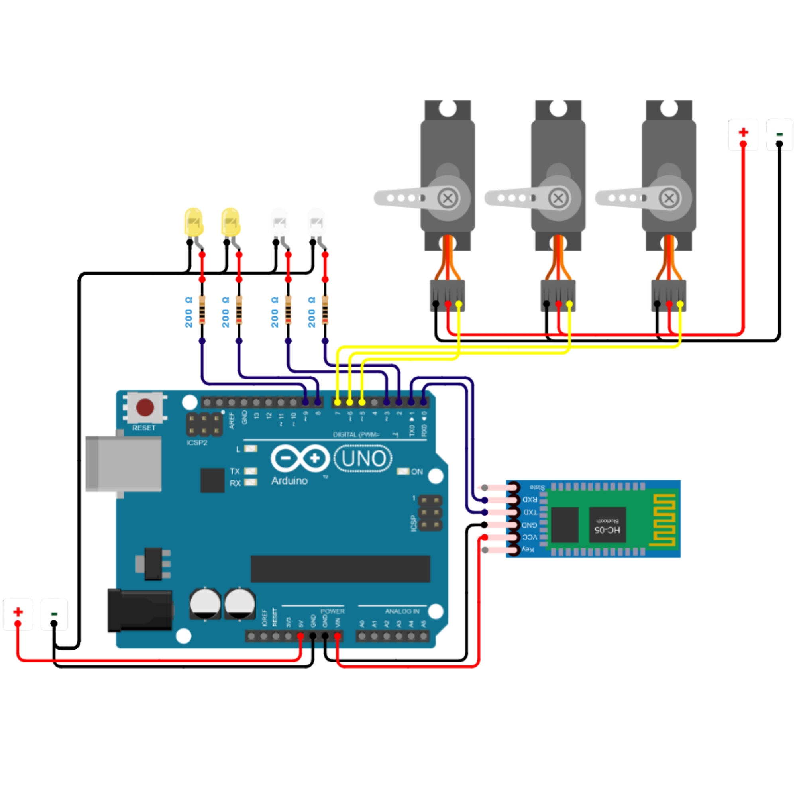

# Firmware Arduino - Caminh�o Basculante

Controle RC de um carrinho basculante via Bluetooth (HC-05) com 3 servos + 4 LEDs.

## Hardware

- Arduino Uno/Nano
- 1x Servo de Dire��o (SG-90)
- 1x Servo de Ca�amba (SG-90)
- 1x Servo de Motor - Rota��o Cont�nua (SG-90 ou similar)
- 4x LEDs (2 far�is + 2 setas)
- 1x M�dulo Bluetooth HC-05
- Fonte externa 5V (m�nimo 1A)

### Imagem do Circuito



## Pinagem

### Servos

| Componente    | Pino Arduino | Fun��o               | Faixa                          |
| ------------- | ------------ | -------------------- | ------------------------------ |
| Servo Dire��o | D5           | Controle de dire��o  | 45�-135�                       |
| Servo Ca�amba | D6           | Subir/descer ca�amba | 0�-90�                         |
| Servo Motor   | D7           | Rota��o cont�nua     | 0�=r�, 90�=parado, 180�=frente |

### LEDs

| Componente     | Pino Arduino | Fun��o               |
| -------------- | ------------ | -------------------- |
| Farol Esquerdo | D2           | Ilumina��o frontal   |
| Farol Direito  | D3           | Ilumina��o frontal   |
| Seta Esquerda  | D8           | Indicador de dire��o |
| Seta Direita   | D9           | Indicador de dire��o |

### Bluetooth

| Componente    | Pino Arduino | Observa��o |
| ------------- | ------------ | ---------- |
| HC-05 TX ? RX | D0           | Serial RX  |
| HC-05 RX ? TX | D1           | Serial TX  |

### Alimenta��o

| Componente | Alimenta��o       | Observa��o                           |
| ---------- | ----------------- | ------------------------------------ |
| Arduino    | USB ou 7-12V      | Vin ou USB                           |
| Servos     | 5V externa        | N�O usar do Arduino (muita corrente) |
| HC-05      | 5V                | Pode usar do Arduino                 |
| LEDs       | 5V via resistores | Pode usar do Arduino                 |
| GND comum  | GND               | Arduino + servos + HC-05             |

**Importante**: Desconecte os pinos RX/TX do HC-05 ao carregar o sketch via USB.

## Diagrama de Liga��es

```
                    Arduino Uno
                    +-----------+
                    �      D0   �---- HC-05 TX (RX Serial)
                    �      D1   �---- HC-05 RX (TX Serial)
                    �      D2   �---- Farol Esquerdo (LED)
                    �      D3   �---- Farol Direito (LED)
              Servo �      D4   �
              Motor �      D5   �---- Servo Dire��o
              Servo �      D6   �---- Servo Ca�amba
              Servo �      D7   �---- Servo Motor
              Dir.  �      D8   �---- Seta Esquerda (LED)
              Cac.  �      D9   �---- Seta Direita (LED)
                    �      D10  �
                    �      D11  �
                    �      D12  �
                    �      D13  �
                    �           �
                    �      5V   �---- VCC HC-05
                    �      GND  �---- GND Comum
                    �      Vin  �---- Alimenta��o externa 7-12V
                    +-----------+
```

## Protocolo de Comandos

### Movimenta��o (simples ou compostos)

| Comando | A��o              | Detalhes                    |
| ------- | ----------------- | --------------------------- |
| `F`     | Frente            | Servo motor ? 180�          |
| `B`     | R�                | Servo motor ? 0�            |
| `S`     | Parar motor       | Servo motor ? 90�           |
| `L`     | Esquerda          | Servo dire��o ? 120�        |
| `R`     | Direita           | Servo dire��o ? 60�         |
| `C`     | Centro            | Servo dire��o ? 90�         |
| `FL`    | Frente + Esquerda | Motor + dire��o simult�neos |
| `FR`    | Frente + Direita  | Motor + dire��o simult�neos |
| `BL`    | R� + Esquerda     | Motor + dire��o simult�neos |
| `BR`    | R� + Direita      | Motor + dire��o simult�neos |
| `SC`    | Parada total      | Motor para + dire��o centro |

### Ca�amba

| Comando | A��o   | Detalhes                          |
| ------- | ------ | --------------------------------- |
| `U`     | Subir  | Ca�amba 0� ? 90� (n�o-bloqueante) |
| `D`     | Descer | Ca�amba 90� ? 0� (n�o-bloqueante) |
| `X`     | Parar  | Congela ca�amba na posi��o atual  |

### Ilumina��o

| Comando | A��o                           |
| ------- | ------------------------------ |
| `HH`    | Toggle far�is (ligar/desligar) |
| `TI`    | Seta esquerda ligar            |
| `TO`    | Seta direita ligar             |
| `TX`    | Desligar todas as setas        |

### Respostas

```
ACK|TRUCK|<comando>|OK
```

## Funcionamento

### Setup

1. Inicializa Serial (9600 baud) e Bluetooth
2. Configura pinos dos LEDs como OUTPUT
3. Conecta os 3 servos
4. Posi��o inicial: dire��o centro (90�), ca�amba baixa (0�), motor parado (90�)
5. LEDs desligados

### Loop (a cada ciclo)

1. **Processa Bluetooth**: L� caracteres, monta string, processa ao receber `\n`
2. **Atualiza ca�amba**: Move 1 grau por ciclo (a cada 15ms) - n�o-bloqueante

### Ca�amba N�o-Bloqueante

A ca�amba usa `millis()` ao inv�s de `delay()`, permitindo que o Arduino processe novos comandos BT enquanto a ca�amba se move:

- Move 1 grau a cada 15ms
- N�o bloqueia o `loop()`
- Pode ser interrompida a qualquer momento (comando `X`)

### Comandos Compostos

O firmware suporta comandos de 1 ou 2 caracteres:

- **1� caractere**: motor (F/B/S) ou dire��o (L/R/C)
- **2� caractere**: dire��o (L/R/C) � opcional

Exemplo: `FL` = motor frente + dire��o esquerda

### Debug Serial

O firmware imprime no Serial Monitor (9600 baud):

- `=== CAMINHAO BASCULANTE v2.0 ===` � mensagem de boot
- `RX: <comando>` � comando recebido
- `ACK|TRUCK|<comando>|OK` � confirma��o enviada

## Consumo de Energia

| Componente         | Corrente t�pica |
| ------------------ | --------------- |
| Servo SG-90 (cada) | ~150mA          |
| HC-05              | ~40mA           |
| Arduino Uno        | ~50mA           |
| LEDs (4x)          | ~80mA           |
| **Total**          | **~620mA**      |

Use uma fonte externa de **m�nimo 1A** para alimentar os 3 servos + Arduino.

## Sketch: `caminhao_basculante_firmware.ino`

Arquivo com ~280 linhas. Cont�m:

- Defini��es de pinos e constantes
- Vari�veis de estado (motor, dire��o, ca�amba, LEDs)
- Fun��o `setup()` � inicializa��o dos componentes
- Fun��o `loop()` � processamento BT + atualiza��o ca�amba
- Fun��o `executarComando()` � parser de comandos
- Fun��es de atualiza��o: `atualizarMotor()`, `atualizarDirecao()`, `atualizarLEDs()`
- Fun��o `atualizarCacamba()` � movimenta��o n�o-bloqueante
- Fun��o `enviarACK()` � confirma��o de comandos

## Vers�o

- **v2.0** - Comandos compostos (motor + dire��o) + LEDs
- **v1.0** - Vers�o inicial
