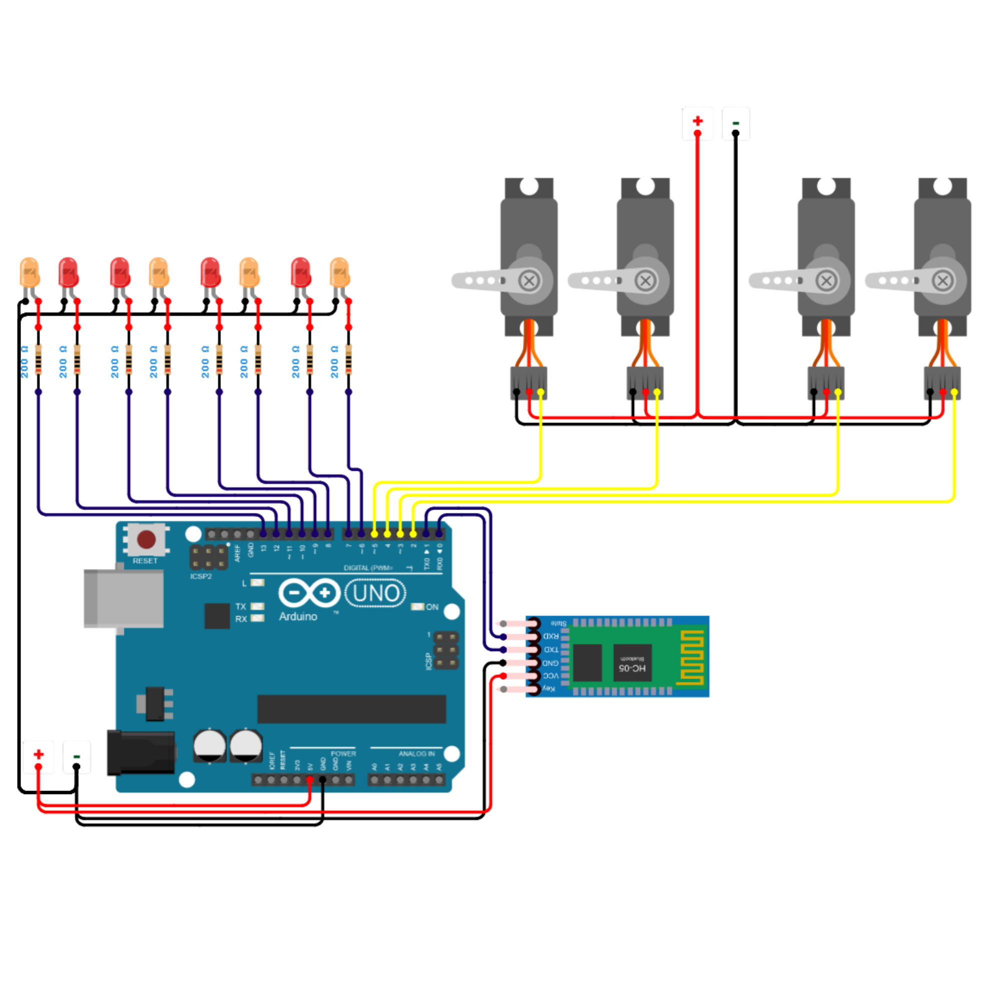

# Firmware Arduino - Ferrovia

Controle de 4 switches de ferrovia via Bluetooth (HC-05) com movimenta��o suave de servos SG90 e indicadores de dire��o (LEDs).

## Hardware

- Arduino Uno/Nano
- 4x Servos SG90
- 8x LEDs (4 verdes + 4 vermelhos)
- 8x Resistores 200O
- 1x M�dulo Bluetooth HC-05
- Fonte externa 5V para servos

## Diagrama de Liga��es

### Imagem do Circuito



> **Instru��o:** Salve a imagem do Tinkercad como `diagrama_ferrorama.svg` na pasta `images/` deste diret�rio.

### Diagrama em Texto

```
                    Arduino Uno
                    +-----------+
                    �      D0   �---- HC-05 TX (RX Serial)
                    �      D1   �---- HC-05 RX (TX Serial)
              Servo �      D2   �---- Servo 1
              Div 1 �      D3   �---- Servo 2
              Servo �      D4   �---- Servo 3
              Div 2 �      D5   �---- Servo 4
              LED   �      D6   �---- LED Verde Div 1 (Esquerda)
              Div 1 �      D7   �---- LED Vermelho Div 1 (Direita)
              LED   �      D8   �---- LED Verde Div 2 (Esquerda)
              Div 2 �      D9   �---- LED Vermelho Div 2 (Direita)
              LED   �      D10  �---- LED Verde Div 3 (Esquerda)
              Div 3 �      D11  �---- LED Vermelho Div 3 (Direita)
              LED   �      D12  �---- LED Verde Div 4 (Esquerda)
              Div 4 �      D13  �---- LED Vermelho Div 4 (Direita)
                    �           �
                    �      5V   �---- VCC HC-05
                    �      GND  �---- GND Comum
                    �      Vin  �---- Alimenta��o externa 7-12V
                    +-----------+
```

## Pinagem

### Servos (D2 a D5)

| Componente     | Pino Arduino | Observa��o |
| -------------- | ------------ | ---------- |
| Servo Switch 1 | D2           | Divis�o 1  |
| Servo Switch 2 | D3           | Divis�o 2  |
| Servo Switch 3 | D4           | Divis�o 3  |
| Servo Switch 4 | D5           | Divis�o 4  |

### LEDs Indicador de Dire��o (D6 a D13)

Cada divis�o tem 2 LEDs que indicam para qual linha a locomotiva vai seguir:

| Divis�o | LED Esquerda (Verde) | LED Direita (Vermelho) |
| ------- | -------------------- | ---------------------- |
| 1       | D6                   | D7                     |
| 2       | D8                   | D9                     |
| 3       | D10                  | D11                    |
| 4       | D12                  | D13                    |

**Circuito de cada LED:**

```
Pino Arduino ? Resistor 200O ? Anodo (+) LED ? Catodo (-) ? GND
```

### Bluetooth (HC-05)

| Componente    | Pino Arduino | Observa��o |
| ------------- | ------------ | ---------- |
| HC-05 TX ? RX | D0           | Serial RX  |
| HC-05 RX ? TX | D1           | Serial TX  |

### Alimenta��o

| Componente | Alimenta��o       | Observa��o                           |
| ---------- | ----------------- | ------------------------------------ |
| Arduino    | USB ou 7-12V      | Vin ou USB                           |
| Servos     | 5V externa        | N�O usar do Arduino (muita corrente) |
| HC-05      | 5V                | Pode usar do Arduino                 |
| LEDs       | 5V via resistores | Pode usar do Arduino                 |
| GND comum  | GND               | Arduino + servos + HC-05 + LEDs      |

**Importante**: Desconecte os pinos RX/TX do HC-05 ao carregar o sketch via USB.

## Configura��o

Constantes no in�cio do sketch:

```cpp
// Servos (D2 a D5)
const int NUM_SWITCHES = 4;
const int SERVO_PINS[] = {2, 3, 4, 5};

// LEDs Indicador de Dire��o (D6 a D13)
const int LED_LEFT[] = {6, 8, 10, 12};   // Verde - linha esquerda
const int LED_RIGHT[] = {7, 9, 11, 13};  // Vermelho - linha direita

// Bluetooth
const int BAUD_BT = 9600;

// Movimenta��o
const unsigned long HEARTBEAT_INTERVAL = 5000; // 5 segundos
const int ANGLE_LEFT = 0;
const int ANGLE_RIGHT = 180;
const int ANGLE_CENTER = 90;
const int MOVE_DELAY = 15;  // ms entre passos do servo
```

## Indicadores de Dire��o (LEDs)

### L�gica

| �ngulo do Servo | LED Esquerda | LED Direita | Significado                          |
| --------------- | ------------ | ----------- | ------------------------------------ |
| LEFT (0�)       | ? Aceso      | ? Apagado   | Locomotiva vai para linha esquerda   |
| RIGHT (180�)    | ? Apagado    | ? Aceso     | Locomotiva vai para linha direita    |
| CENTER (90�)    | ? Apagado    | ? Apagado   | Neutro (ambas as linhas dispon�veis) |

### Funcionamento

- Quando o servo move para **LEFT (0�)**: LED Verde (esquerda) acende
- Quando o servo move para **RIGHT (180�)**: LED Vermelho (direita) acende
- Quando o servo est� em **CENTER (90�)**: Ambos os LEDs apagam

## Protocolo de Comandos

### Recebido (via Bluetooth Serial)

```
CMD|SWITCH|<id>|SET|LEFT       # Switch para esquerda (0�)
CMD|SWITCH|<id>|SET|RIGHT      # Switch para direita (180�)
CMD|SWITCH|<id>|SET|CENTER     # Switch para centro (90�)
CMD|SWITCH|<id>|ANGLE|<0-180>  # Switch para �ngulo espec�fico
CMD|SWITCH|<id>|STATUS         # Solicitar status do switch
CMD|SWITCH|<id>|RESET          # Resetar para centro (90�)
```

- `<id>`: 1 a 4
- Todas as mensagens terminam com `\n`

### Enviado (respostas)

```
ACK|SWITCH|<id>|<estado>                    # Confirma��o
STATUS|SWITCH|<id>|<angulo>|<estado>|<ts>   # Status completo
```

### Estados poss�veis

| Estado       | Condi��o               |
| ------------ | ---------------------- |
| `LEFT`       | �ngulo <= 10�          |
| `RIGHT`      | �ngulo >= 170�         |
| `CENTER`     | �ngulo entre 85� e 95� |
| `TRANSITION` | Qualquer outro �ngulo  |

## Funcionamento

### Setup

1. Inicializa Serial (debug) e Bluetooth
2. Conecta os 4 servos e move para posi��o central (90�)
3. Inicializa pinos dos LEDs como OUTPUT
4. Envia status de todos os switches

### Loop (a cada ciclo)

1. **Processa Bluetooth**: L� caracteres, monta string, processa ao receber `\n`
2. **Atualiza servos**: Move 1 grau por ciclo (a cada 15ms) at� atingir o alvo
3. **Atualiza LEDs**: Acende LED correspondente � dire��o do desvio
4. **Heartbeat**: Envia status de todos os switches a cada 5 segundos

### Movimenta��o Suave

- Servos N�O pulam direto para o �ngulo alvo
- Movem 1 grau por `MOVE_DELAY` (15ms)
- Exemplo: mover de 90� para 0� = 90 passos � 15ms = 1.35 segundos
- Quando atinge o alvo, envia `STATUS` com o estado final

## Sketch: `ferrovia_firmware.ino`

Arquivo com ~300 linhas. Cont�m:

- Defini��es de pinos e constantes (servos + LEDs)
- Struct `SwitchState` (currentAngle, targetAngle, moving, lastMove)
- Fun��o `setupLEDs()` � inicializa��o dos pinos dos LEDs
- Fun��o `updateLEDs()` � atualiza��o dos LEDs baseado no �ngulo
- Fun��o `processBluetooth()` � leitura serial
- Fun��o `processCommand()` � parser e execu��o
- Fun��o `updateServos()` � movimenta��o suave
- Fun��es de envio: `sendAck()`, `sendStatus()`, `sendStatusAll()`

## Vers�o

- **v3.2** - Pinagem reorganizada (servos D2-D5, LEDs D6-D13)
- **v3.1** - Indicador de dire��o com LEDs (2 por desvio)
- **v3.0** - Sistema de sem�foro com LEDs
- **v2.2** - Movimenta��o suave de servos
- **v2.0** - Comunica��o Bluetooth
- **v1.0** - Vers�o inicial
